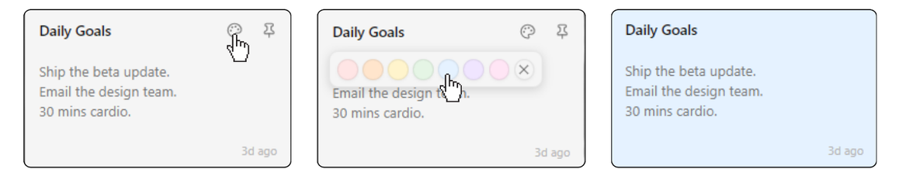

# Mini Notes

Quickly jot down notes during your focus sessions without worrying about organization. Review them later in a colorful masonry view where you can pin, tag, and arrange what matters.

- view your notes in a google keep-notes similar layout
- change the bg color of your notes!
- tag your most important notes
- filter your notes based on their tags!

**Light Theme**

**Dark Theme**

### **IOS & Android Mobile Support**

---

### 
**Coloring Notes:**  Hover on a note >> select the color you want.

---

### Creating a New Mini Note
- Press `Ctrl + [` (default hotkey), or
- Use the command palette and search for "Mini Notes: Create new mini note"
- Notes are created in the "Mini Notes" folder by default (configurable in settings)

### Opening the Masonry View
- Press `Ctrl + ]` (default hotkey), or
- Click the grid icon in the left ribbon, or
- Use the command palette `(Ctrl/Cmd + P)` and search for "Mini Notes: Open view"
- The view will intially load all notes (change the Source folder later on from the settings)

### Working with Notes
- Click any card to open the note in the editor
- Click the pin icon to pin/unpin a note
- Drag cards to reorder them
- Click tags in the filter dropdown to filter by specific tags
- Click the pin filter icon to show only pinned notes

### Customizing the View
- Edit the title by clicking on it directly
- Open **Settings → Mini Notes** to configure:
  - View title (shown at the top of the dashboard)
  - Source folder (where notes are loaded from)
  - Maximum notes to display (default: 150)
  - Theme color preferences

Don't forget to give it a ⭐ on [GitHub](https://github.com/rknastenka/mini-notes) to help others discover it!

---

If you find Mini Notes helpful, please consider supporting my work!

